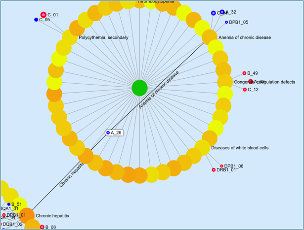
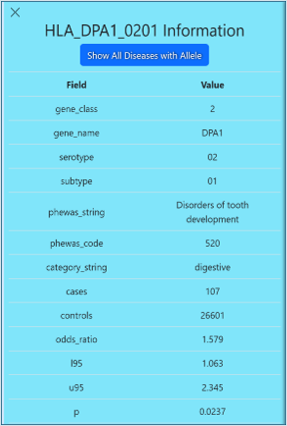
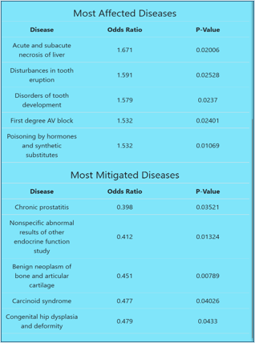
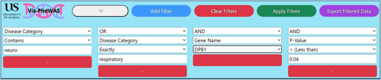
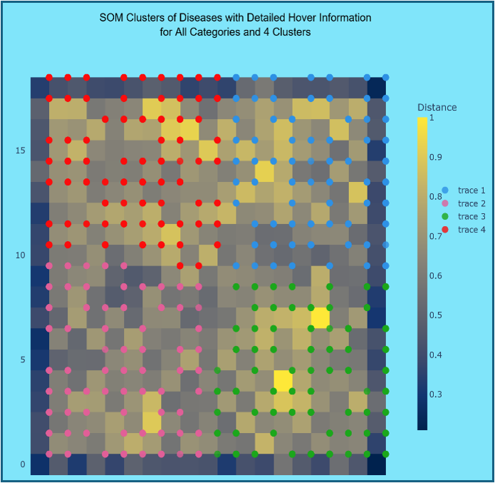

# Vis-PheWAS

Vis-PheWAS is a visualisation platform designed to facilitate the exploration and interpretation of phenome-wide association studies (PheWAS). It provides researchers and students with an intuitive interface to examine associations between genetic variants and a wide range of phenotypes.

Please note that as the web-hosted version was deployed at my own cost, it is not currently running. However, if you would like to view it, please contact me, and I will make it available 🙂.

## User Guide

### 🔍 Interactive Network Graph
- The network starts with **disease categories** as the highest-level nodes.
- Clicking on a **disease category** reveals the diseases associated with it. The diseases are coloured on a yellow-orange gradient representing how many alleles are associated with the disease.
- Selecting a **disease** expands the graph to show the **alleles involved**. These are styled as such:
  - Coloured according to whether they are protective (blue) or contributory (red) in the disease. 
  - The border size of the node represents the magnitude of deviation of the odds ratio (OR) from one, indicating how strongly an allele is associated with increased or decreased disease risk.
  - The size of the node represents the p value of the allele in the disease selected, where lower values (stronger significance) are larger.
- Users can **zoom**, **pan**, and **click** on nodes to navigate through associations interactively.



### 🧬 Allele Information
- Clicking on an **allele node** opens a **side panel** displaying detailed information.
- The panel includes:
  - **p-value** and **odds ratio (OR)** of the allele-disease association.
  - Diseases where the allele has the **most significant contributory or protective effect**.
  - Additional relevant genetic data.
- Hovering over an allele highlights **shared associations** with multiple diseases.

<div align="center">
   
   
</div>

### 🎚 Filter Panel
# Vis-PheWAS

Vis-PheWAS is a visualisation platform designed to facilitate the exploration and interpretation of phenome-wide association studies (PheWAS). It provides researchers and students with an intuitive interface to examine associations between genetic variants and a wide range of phenotypes.

## User Guide

### 🔍 Interactive Network Graph
- The network starts with **disease categories** as the highest-level nodes.
- Clicking on a **disease category** reveals the diseases associated with it. The diseases are coloured on a yellow-orange gradient representing how many alleles are associated with the disease.
- Selecting a **disease** expands the graph to show the **alleles involved**. These are styled as such:
  - Coloured according to whether they are protective (blue) or contributory (red) in the disease. 
  - The border size of the node represents the magnitude of deviation of the odds ratio (OR) from one, indicating how strongly an allele is associated with increased or decreased disease risk.
  - The size of the node represents the p value of the allele in the disease selected, where lower values (stronger significance) are larger.
- Users can **zoom**, **pan**, and **click** on nodes to navigate through associations interactively.


### 🧬 Allele Information
- Clicking on an **allele node** opens a **side panel** displaying detailed information.
- The panel includes:
  - **p-value** and **odds ratio (OR)** of the allele-disease association.
  - Diseases where the allele has the **most significant contributory or protective effect**.
  - Additional relevant genetic data.
- Hovering over an allele highlights **shared associations** with multiple diseases.

<div align="center">
   
   
</div>

### 🎚 Filter Panel
The tool provides a flexible filtering system to refine displayed data. Users can apply different filters based on the following categories:

| Field             | Type      | Operators Available | Description |
|------------------|----------|----------------------|-------------|
| `SNP`           | Text     | `==`, `contains`    | Single nucleotide polymorphism identifier |
| `PheWAS Code`   | Text     | `==`, `contains`    | Unique code representing a PheWAS phenotype |
| `PheWAS String` | Text     | `==`, `contains`    | Human-readable name of a phenotype |
| `Disease Category` | Text     | `==`, `contains`    | Broad category classification of a disease |
| `Serotype`      | Text     | `==`, `contains`    | Serological classification of an allele |
| `Subtype`       | Text     | `==`, `contains`    | More granular classification of an allele |
| `Cases`         | Number   | `>`, `<`, `>=`, `<=` | Number of cases with the condition |
| `Controls`      | Number   | `>`, `<`, `>=`, `<=` | Number of control subjects (without the condition) |
| `p-value`  | Number   | `>`, `<`, `>=`, `<=` | Statistical significance of the association (Max: 0.05, Step: 0.005) |
| `Odds Ratio`    | Number   | `>`, `<`, `>=`, `<=` | Measure of association strength (Step: 0.25) |
| `L95`           | Number   | `>`, `<`, `>=`, `<=` | Lower bound of the 95% confidence interval for OR |
| `U95`           | Number   | `>`, `<`, `>=`, `<=` | Upper bound of the 95% confidence interval for OR |
| `MAF`           | Number   | `>`, `<`, `>=`, `<=` | Minor allele frequency |
| `Gene Class`    | Dropdown | `Class 1`, `Class 2` | Classification of the gene (MHC Class I or II) |
| `Gene Name`     | Dropdown | `A, B, C, DPA1, DPB1, DQA1, DQB1, DRB1` | Specific HLA gene name |

Users can apply up to 8 filters simultaneously, combining logical operators (AND, OR) and exporting filtered results as a **CSV file** for further analysis.



### 📑 Side Panel
- Three collapsible tabs provide additional controls:
  - **Options Tab** – Adjust allele resolution settings.
  - **Tools Tab** – Generate SOM clusters.
  - **Help Tab** – View user instructions and tooltips.

### 📊 Self-Organising Map (SOM) Visualisation
- Users can generate **self-organising maps** to cluster data based on **disease** or **allele similarity**.
- The SOM is displayed in a **separate pop-up** with filtering options:
  - **Gene class filtering** (for allele clustering)
  - **Disease category filtering** (for disease clustering)
  - Customisation of **number of k-means clusters**.
- Users can download clustering results as a **CSV file**.



## Deployment Instructions

### Prerequisites

- Docker and Docker Compose installed on your system. You can follow the official Docker documentation to install Docker and Docker Compose on your system.
  - You can access the installation instructions here: [Get Docker](https://docs.docker.com/get-docker/).
- SSL Certificates (cert.pem and key.pem) for HTTPS configuration.
- `docker-compose.yml` file from the repository.
- If using Windows, OpenSSL is required to generate SSL certificates. Follow this [link](https://slproweb.com/products/Win32OpenSSL.html) and download the latest version of OpenSSL.
  - Alternatively, you can use the Windows Subsystem for Linux (WSL) to generate the certificates or use your preferred package manager (e.g. [chocolatey](https://github.com/chocolatey/choco)) to install OpenSSL.

### Project Directory Structure
Make sure that your project directory contains the following before starting:

```
Project Directory Structure:
├── cert.pem
├── key.pem
├── docker-compose.yml
├── docker.env
├── docker.env.example
```

### Step 1: Prepare SSL Certificates

To enable HTTPS, you'll need an SSL certificate and a private key. You can obtain them from a Certificate Authority (CA) or generate self-signed certificates for testing purposes.

#### Generate Self-Signed SSL Certificates (Optional)

For development or testing purposes, you can generate a self-signed certificate using the following command:

```
openssl req -x509 -nodes -days 365 -newkey rsa:2048 -keyout key.pem -out cert.pem
```

Place the generated `cert.pem` and `key.pem` files in the same directory as your `docker-compose.yml` file.

### Step 2: Set Up Environment Variables

Create a `docker.env` file in the same directory as your `docker-compose.yml` file. This file will hold the environment variables required for the services to run.

You only need the following variables:

```
POSTGRES_PASSWORD=your_database_password
DB_PASS=your_database_password
DJANGO_SECRET_KEY=your_django_secret_key
DJANGO_ALLOWED_HOSTS=['yourdomain.com', 'localhost', '127.0.0.1']
```

Replace `your_database_password`, `your_django_secret_key`, and `DJANGO_ALLOWED_HOSTS` with your own values. If you're deploying the application locally, you can use the example values for `DJANGO_ALLOWED_HOSTS` and if you need a Django secret key, you can generate one using the following command:

```
python -c 'from django.core.management.utils import get_random_secret_key; print(get_random_secret_key())'
```

If you don't have Python installed, you can also go here: [Django Secret Key Generator](https://djecrety.ir/).

An example file has also been included (`docker.env.example`) that you can use as a template, just remove the `.example` from the file name and fill it out with your intended details.

### Step 3: Deploy the Application

Once you've set up the environment variables and SSL certificates, you can deploy the application using Docker Compose.

Run the following command:

```
docker compose up -d
```

This command will start the application in detached mode.

### Step 4: Access the Application

- The application will be accessible at `https://localhost` by default.
- The application automatically redirects HTTP traffic to HTTPS.

### Step 5: Stop and Remove the Application

To stop the application and remove the containers, run the following command:

```
docker compose down
```

This command will stop and remove the containers, but it will retain the database volume.

If you want to remove the database volume as well, you can add the `-v` flag:

```
docker compose down -v
```

This will remove the containers and the database volume.

### Troubleshooting
- If the application isn’t accessible at `https://localhost`, check the Docker logs by running:
```
docker compose logs
```
- Ensure Docker is running, and that the SSL certificates are correctly placed in the project directory.
